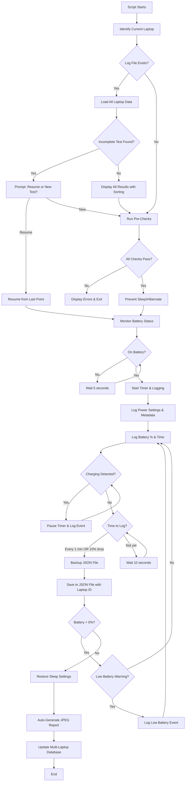

# Windows Laptop Battery Testing Script

## Overview

A portable Python application that monitors battery discharge, logs data at regular intervals, survives hard shutdowns, and generates a visual report with hardware specifications. Supports testing multiple laptops with sorting and comparison capabilities, tracking which laptop is currently running the test.

## Architecture



## Implementation Details

### Core Components

1. **Battery Monitoring** (`battery_monitor.py`)

- Use `psutil` library for basic battery status (percentage, charging status)
- Use `wmi` (Windows Management Instrumentation) for detailed battery information:
  - **Design Capacity** (mWh) - Original maximum capacity (via Win32_Battery.DesignCapacity)
  - **Full Charge Capacity** (mWh) - Current maximum capacity (via Win32_Battery.FullChargeCapacity)
  - **Battery Health Percentage** - Calculated as (FullChargeCapacity / DesignCapacity) * 100
  - **Current Percentage** - Via Win32_Battery.EstimatedChargeRemaining
  - **Charging Status** - Via Win32_Battery.BatteryStatus
  - **Cycle Count** - Attempt via WMI, but may be null/unavailable on some systems
- Detect when laptop switches from AC to battery power
- Monitor battery percentage and charging status
- **Continuously monitor AC power connection** (every poll cycle)
- **Detect charging events during test** (pause timer, log event)
- Poll every 10 seconds for responsiveness
- Handle cases where battery information is unavailable
- Note: Cycle count may require parsing `powercfg /batteryreport` HTML as fallback (optional)

2. **Data Logging** (`data_logger.py`)

- Store data in JSON format: `battery_test_data.json`
- Multi-laptop support: Store test results for multiple laptops indexed by unique laptop ID
- **Multiple test runs per laptop**: Each laptop has `test_runs` array
- Each test run includes:
  - Unique run ID (timestamp-based)
  - Test status: "completed", "interrupted", "low_battery_shutdown", "hard_shutdown", "invalidated"
  - Unique laptop identifier (serial number or system UUID)
  - Hardware info (CPU, RAM, HD, etc.)
  - Test results (entries, timestamps, battery percentages)
  - Test metadata (start time, end time, total runtime, power settings, OS info, etc.)
  - Battery health info (design capacity, actual capacity, health %)
  - Charging events log (if charger was plugged in during test)
- Log entries include: timestamp, battery percentage, elapsed time, charging status
- Log triggers:
    - Every 1 minute (time-based)
    - Every 10% battery drop (percentage-based)
- Atomic file writes to prevent corruption during hard shutdown
- Track "current_laptop_id" to identify which laptop is running the test
- **Periodic backups**: Automatic backup every N minutes
- **Version tracking**: Include data format version in JSON

3. **Hardware Detection** (`hardware_info.py`)

- Use `psutil` for CPU, RAM info
- Use `wmi` (Windows Management Instrumentation) for detailed hardware:
    - CPU model and cores
    - RAM size and type
    - Hard drive model and capacity
    - System manufacturer and model
    - **System serial number or UUID** (for unique laptop identification)
    - **Battery information** (design capacity, full charge capacity, health)
- Generate unique laptop ID from: serial number + system model + CPU model (fallback if serial unavailable)
- Cache hardware info on first run
- Collect battery health metrics at hardware detection time

4. **Results Display** (`results_viewer.py`)

- Parse JSON log file with multi-laptop data
- Display options:
    - **Current laptop results**: Show detailed stats for the laptop currently running
    - **All laptops comparison**: Show summary table with all tested laptops
    - **Sorting capabilities**: Sort by total runtime, battery capacity, discharge rate, etc.
- For each laptop, display:
    - Total runtime
    - Battery percentage at key intervals (100%, 90%, 80%, ..., 10%, 0%)
    - Time to reach each percentage milestone
    - Battery discharge rate (percentage per hour)
    - Hardware specifications
    - Battery health metrics
- Highlight current laptop in comparison view

5. **Report Generator** (`report_generator.py`)

- Use `Pillow` (PIL) for image generation
- Create JPEG image (1920x1080 or similar) with:
    - Hardware specifications section (CPU, RAM, HD, etc.)
    - Battery discharge graph/chart
    - Key statistics (total runtime, average discharge rate)
    - **Battery health metrics** (design capacity, health %)
    - **Test metadata** (power plan, screen brightness, OS version)
    - Test date/time
    - Laptop identifier/name
    - **Test status** (completed/interrupted/etc.)
- Options:
    - Generate report for current laptop: `battery_test_report_[laptop_id].jpg`
    - Generate comparison report: `battery_test_comparison.jpg` (shows all laptops)
    - Generate report for specific test run: `battery_test_report_[laptop_id]_[run_id].jpg`
- Comparison report includes side-by-side stats and discharge curves for multiple laptops
- **Automatic generation**: Auto-generate report when test completes
- **Auto-open option**: Optionally open report after generation

6. **Main Script** (`battery_tester.py`)

- Entry point that orchestrates all components
- On startup:
    - Identify current laptop (get unique ID)
    - Check for existing log file
    - **Check for incomplete tests** (prompt to resume or start new)
    - **Run pre-test validation** (battery 100%, AC disconnected, etc.)
    - If log exists: show all laptop results with sorting options, highlight current laptop
    - If no log or new test: start monitoring for current laptop
- Command-line options:
    - `--list`: Show all tested laptops with summary stats
    - `--compare`: Show comparison view sorted by runtime
    - `--report [laptop_id]`: Generate report for specific laptop (or current if omitted)
    - `--current`: Show only current laptop's results
    - `--resume`: Resume interrupted test (skip prompt)
    - `--validate`: Run pre-checks only, don't start test
    - `--history [laptop_id]`: Show test history for specific laptop
    - `--notes "text"`: Add notes/comments to test run
- Handle graceful shutdown (Ctrl+C) and hard shutdown scenarios
- **Restore power settings** on exit

7. **Test Validation** (`test_validator.py`)

- Pre-test validation checks:
  - Verify battery is at 100% charge
  - Check battery health (design vs actual capacity via WMI)
  - Verify AC power is disconnected
  - Detect if incomplete test exists for current laptop
  - Verify battery is detected by system
- Display validation results with clear error messages
- Option to bypass warnings (with confirmation)
- Return validation status and error details
- Calculate and display battery health percentage

8. **Resume Capability** (`test_resumer.py`)

- Detect incomplete/interrupted tests on startup
- Identify last logged entry point
- Prompt user: Resume or Start New?
- Resume functionality:
  - Load previous test data
  - Continue from last logged timestamp
  - Maintain test run ID
  - Mark test as "resumed"
- Start new functionality:
  - Archive previous incomplete test
  - Start fresh test run
  - Generate new test run ID

9. **Power Management** (`power_manager.py`)

- **Set power plan to Performance mode** when starting test:
  - Get current power plan (to restore later)
  - Set to "High Performance" power plan via Windows powercfg command or API
  - Verify power plan change was successful
- Prevent sleep/hibernate during test:
  - Set system to stay awake
  - Disable sleep timers
  - Keep display on (or allow dimming)
- Log power settings at test start:
  - Original power plan name (before change)
  - Active power plan name (should be "High Performance")
  - Screen brightness percentage
  - Sleep/hibernate settings
- Monitor for power setting changes during test
- Restore original power settings after test completion:
  - Restore original power plan
  - Restore sleep/hibernate settings
- Handle system sleep events gracefully

10. **Charging Detection** (`charging_monitor.py`)

- Continuously monitor AC power connection status
- Detect if charger is plugged in during test
- When charging detected:
  - Pause timer
  - Log charging event with timestamp
  - Display warning message
  - Option to invalidate test or continue
- Resume monitoring when charging stops
- Track total time spent charging during test

11. **Battery Health Monitor** (`battery_health.py`)

- Retrieve battery health metrics via WMI (Win32_Battery):
  - **Design Capacity** (mWh) - Reliably available via WMI
  - **Full Charge Capacity** (mWh) - Reliably available via WMI
  - **Health Percentage** - Calculated: (FullChargeCapacity / DesignCapacity) * 100
  - **Cycle Count** - Attempt via WMI, but may be null/unavailable (store as null if unavailable)
  - **Battery Temperature** - Not available via standard Windows APIs (skip)
- Log health metrics at test start
- Include health data in test metadata
- Display health warnings if below threshold (e.g., <80%)
- Track health degradation across multiple test runs
- Handle cases where battery info is unavailable gracefully

12. **Test Metadata Logger** (`metadata_logger.py`)

- Collect and log test environment data:
  - OS version and build number
  - Original power plan name (before test started)
  - Active power plan name (set to "High Performance" for test)
  - Screen brightness percentage
  - WiFi/network status (enabled/disabled)
  - Script version that ran the test
  - Test notes/comments (user-provided)
  - Top CPU-consuming processes at start
- Store metadata with each test run
- Include metadata in reports and exports
- Note: Power plan is automatically set to Performance mode for consistent testing conditions

13. **Low Battery Handler** (`low_battery_handler.py`)

- Monitor for low battery warnings (typically 10-15%)
- Detect when system enters low power state
- Log last known battery percentage before shutdown
- Handle graceful shutdown vs hard shutdown scenarios
- Mark test status appropriately:
  - "completed" - reached 0% normally
  - "low_battery_shutdown" - system shut down at low battery
  - "hard_shutdown" - power lost abruptly
- Estimate final runtime based on last logged point

14. **Data Backup Manager** (`backup_manager.py`)

- Periodic backup of JSON data file:
  - Backup every N minutes (configurable, default 5 min)
  - Backup before major operations
  - Keep last 3-5 backups
  - Timestamp backup files: `battery_test_data_backup_YYYYMMDD_HHMMSS.json`
- Recovery functionality:
  - Detect corrupted JSON files
  - Attempt recovery from backups
  - Validate JSON structure before loading
- Version data file format:
  - Include version number in JSON
  - Handle migration between versions

### File Structure

```javascript
laptop-battery-tester/
├── battery_tester.py          # Main entry point
├── battery_monitor.py          # Battery status detection
├── data_logger.py              # Data persistence (multi-laptop)
├── hardware_info.py            # Hardware detection & laptop ID
├── results_viewer.py           # Results display & sorting
├── report_generator.py         # JPEG report generation
├── test_validator.py           # Pre-test validation checks
├── test_resumer.py             # Resume interrupted tests
├── power_manager.py            # Sleep prevention & power settings
├── charging_monitor.py         # AC power detection during test
├── battery_health.py            # Battery health metrics
├── metadata_logger.py          # Test environment metadata
├── low_battery_handler.py      # Low battery detection & handling
├── backup_manager.py            # Data backup & recovery
├── requirements.txt            # Python dependencies
├── requirements-dev.txt        # Development dependencies
├── build.spec                  # PyInstaller spec file
├── build.bat                   # Windows build script
├── README.md                   # Usage instructions
├── BUILD.md                    # Build instructions
└── battery_test_data.json      # Multi-laptop log file (generated)
```

### Dependencies

**Runtime Dependencies** (included in executable):

- `psutil` - Basic battery status (percentage, charging), CPU, RAM info
- `Pillow` - Image generation
- `wmi` - Windows hardware details and battery information (Windows-only)
  - Provides: Design Capacity, Full Charge Capacity, Battery Status
  - Note: Cycle count may not always be available via WMI
- `pywin32` - Windows API support (required for wmi library)
- `matplotlib` (optional) - For better chart generation in report

**Build Dependencies** (only needed for creating executable):

- `pyinstaller>=5.0` - Executable bundling tool

### Battery Health Information Availability

**Reliably Available via WMI (Win32_Battery):**

- Design Capacity (mWh) - Original maximum battery capacity
- Full Charge Capacity (mWh) - Current maximum battery capacity  
- Health Percentage - Calculated as (FullChargeCapacity / DesignCapacity) * 100
- Current Percentage - Estimated charge remaining
- Charging Status - Whether battery is charging or discharging

**Limited Availability:**

- Cycle Count - May be available via WMI on some systems, but often returns null/unavailable
  - Optional fallback: Parse `powercfg /batteryreport` HTML (more complex, not always reliable)
  - Recommendation: Store as null if unavailable, note in report

**Not Available via Standard Windows APIs:**

- Battery Temperature - Not exposed through WMI or standard APIs
- Individual Cell Voltage - Not available via standard methods

**Implementation Notes:**

- Primary data source: WMI (wmi library) for reliable battery metrics
- Secondary: psutil for basic status (percentage, charging) when WMI unavailable
- Gracefully handle cases where battery information is unavailable
- Display "N/A" or "Not Available" in reports when data cannot be retrieved

### Key Features

- **Portable**: Standalone Windows executable - no Python installation required, runs on any Windows 10/11 machine
- **Resilient**: JSON logging survives hard shutdowns
- **Informative**: Detailed hardware specs and battery statistics
- **Visual**: JPEG report for easy sharing/documentation
- **Smart Logging**: Dual-trigger system (time + percentage)
- **Multi-Laptop Support**: Track and compare battery stats across multiple laptops
- **Sorting & Comparison**: Sort laptops by runtime, discharge rate, or other metrics
- **Current Laptop Tracking**: Automatically identify and highlight the laptop running the test
- **Test Validation**: Pre-test checks ensure battery is 100%, AC disconnected, system ready
- **Resume Capability**: Resume interrupted tests from last logged point
- **Multiple Test Runs**: Track multiple test runs per laptop to monitor battery degradation
- **Power Management**: Set power plan to Performance mode for consistent testing, prevent sleep/hibernate during test, log power settings, restore original settings after test
- **Charging Detection**: Detect and log if charger is plugged in during test
- **Battery Health**: Track design capacity, actual capacity, and health percentage via WMI
- **Test Metadata**: Log OS version, power plan, screen brightness, and other environment details
- **Low Battery Handling**: Detect and handle low battery warnings and system shutdowns
- **Data Backup**: Automatic periodic backups and recovery from corruption
- **Auto-Report Generation**: Automatically generate report when test completes

### Data Format

JSON log structure (multi-laptop):

```json
{
  "data_version": "1.0",
  "current_laptop_id": "LAPTOP-ABC123",
  "script_version": "1.0.0",
  "laptops": {
    "LAPTOP-ABC123": {
      "laptop_id": "LAPTOP-ABC123",
      "hardware_info": {
        "cpu": "Intel Core i7-12700H",
        "cpu_cores": 14,
        "ram_gb": 16,
        "hdd_model": "Samsung SSD 980",
        "hdd_capacity_gb": 512,
        "system_model": "Dell XPS 15",
        "system_serial": "ABC123456",
        "manufacturer": "Dell Inc."
      },
      "test_runs": [
        {
          "run_id": "run_2024-01-01_10-00-00",
          "test_start_time": "2024-01-01T10:00:00",
          "test_end_time": "2024-01-01T15:30:00",
          "status": "completed",
          "total_runtime_seconds": 19800,
          "resumed": false,
          "battery_info": {
            "design_capacity_mwh": 84000,
            "full_charge_capacity_mwh": 78000,
            "health_percent": 92.8,
            "cycles": null
          },
          "test_metadata": {
            "os_version": "Windows 11 22H2",
            "os_build": "22621.3007",
            "original_power_plan": "Balanced",
            "active_power_plan": "High Performance",
            "screen_brightness": 50,
            "wifi_enabled": true,
            "script_version": "1.0.0",
            "notes": "First test run",
            "top_processes": ["chrome.exe", "explorer.exe"]
          },
          "power_events": [
            {"timestamp": "2024-01-01T10:00:00", "event": "test_started", "ac_connected": false},
            {"timestamp": "2024-01-01T12:30:00", "event": "charging_detected", "ac_connected": true},
            {"timestamp": "2024-01-01T12:35:00", "event": "charging_stopped", "ac_connected": false}
          ],
          "low_battery_events": [
            {"timestamp": "2024-01-01T15:20:00", "battery_percent": 5, "event": "low_battery_warning"}
          ],
          "entries": [
            {"timestamp": "2024-01-01T10:00:00", "battery_percent": 100, "elapsed_seconds": 0, "charging": false},
            {"timestamp": "2024-01-01T10:01:00", "battery_percent": 99, "elapsed_seconds": 60, "charging": false},
            ...
          ]
        }
      ]
    },
    "LAPTOP-XYZ789": {
      "laptop_id": "LAPTOP-XYZ789",
      "hardware_info": {...},
      "test_runs": [
        {
          "run_id": "run_2024-01-02_09-00-00",
          "test_start_time": "2024-01-02T09:00:00",
          ...
        }
      ]
    }
  }
}
```

## Implementation Todos

1. **Setup project structure** - Create main files and requirements.txt

2. **Implement hardware detection** - Collect CPU, RAM, HD, system info, generate unique laptop ID

3. **Implement battery monitoring** - Detect AC/battery switch, monitor percentage, detect charging during test, retrieve battery health via WMI

4. **Implement data logging** - JSON persistence with dual-trigger system, multi-laptop support, multiple test runs

5. **Implement laptop identification** - Generate unique IDs from serial/UUID, track current laptop

6. **Implement test validation** - Pre-test checks (100% battery, AC disconnected, battery health, etc.)

7. **Implement resume capability** - Detect and resume interrupted tests

8. **Implement power management** - Set power plan to Performance mode at test start, prevent sleep/hibernate, log power settings, restore original power plan on exit

9. **Implement charging detection** - Monitor AC power during test, pause timer when charging detected

10. **Implement battery health monitoring** - Track design capacity, actual capacity, health percentage via WMI (handle cycle count as optional)

11. **Implement metadata logging** - Log OS version, power plan, screen brightness, etc.

12. **Implement low battery handling** - Detect low battery warnings, handle shutdowns gracefully

13. **Implement data backup** - Periodic backups, recovery from corruption, version tracking

14. **Implement results viewer** - Parse and display test results with sorting and comparison

15. **Implement report generator** - Create JPEG with hardware info and battery stats (single & comparison), auto-generate on completion

16. **Create main script** - Orchestrate all components with proper flow control, CLI options

17. **Add error handling** - Handle edge cases (no battery, already charging, WMI access denied, etc.)

18. **Add sorting functionality** - Sort laptops by runtime, discharge rate, battery capacity, etc.

19. **Create build configuration** - Set up PyInstaller spec file and build script for creating portable executable
